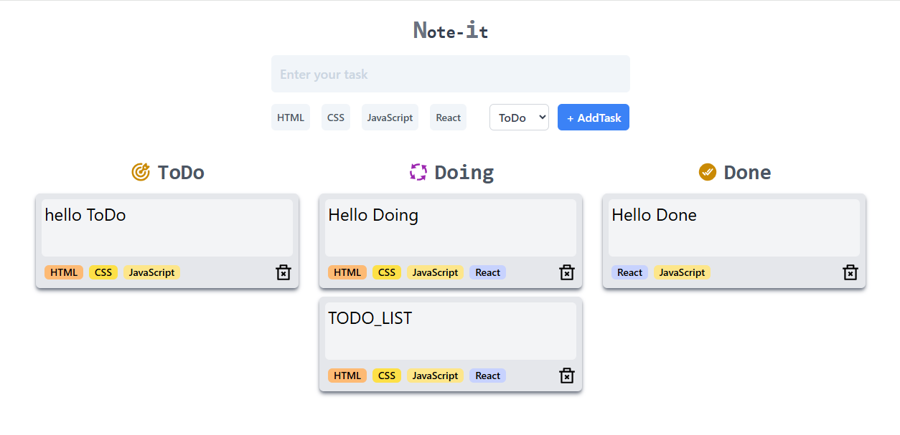

📝 To Do Note It
A clean,  status-based task organizer minimalist to‑do & note‑taking web app, deployed on Netlify and ready for your everyday use!
 — categorize your notes into "ToDo", "Doing", or "Done" columns and tag them with tech skills like HTML, CSS, JavaScript, and React!

🔗 Live Demo
Check it out live at: https://todo-note-it.netlify.app/

🚀 Features
Three-column layout: ToDo, Doing, Done

Create notes by choosing a status and tags

Tag options include: HTML, CSS, JavaScript, and React — each styled with its own color

Responsive layout for easy task management on all devices

Lightweight and intuitive design

🧰 Tech Stack
HTML, CSS, JavaScript, React

Data persistence with localStorage

Deployed with Netlify

⚙️ Getting Started
git clone https://github.com/RobiMankhinStart/To_Do.git
cd To_Do
npm install
npm run dev
Deploy
Simply push your index.html, CSS, and JS to any static host (Netlify works great! 😊)

📸 Screenshot

📚 Usage
Open the app via the live demo or locally.

Fill in your note content.

Choose a status: ToDo / Doing / Done.

Select one or more tags (optional).

AddTask — your note will be displayed in the respective column with tags shown below the content.
Type a task or note and hit Enter or AddTask.

click 🗑️ to remove it.

🛠️ Customize & Extend / 💡 Future Improvements
Add due dates or reminder alerts

Editable notes

Tagging or categorizing notes

Drag‑and‑drop reordering

Sync across devices via cloud backend

📝 Contributing
Contributions, ideas, or improvements are welcome!

Fork the repository

Create a feature branch (git checkout -b feature/YourIdea)

Commit and push your changes

Open a pull request

📄 License
This project is MIT-licensed, so feel free to use it in your own apps — even those that are commercial.

Sources

